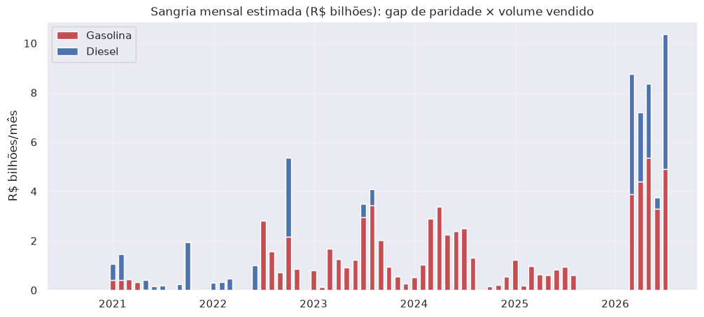
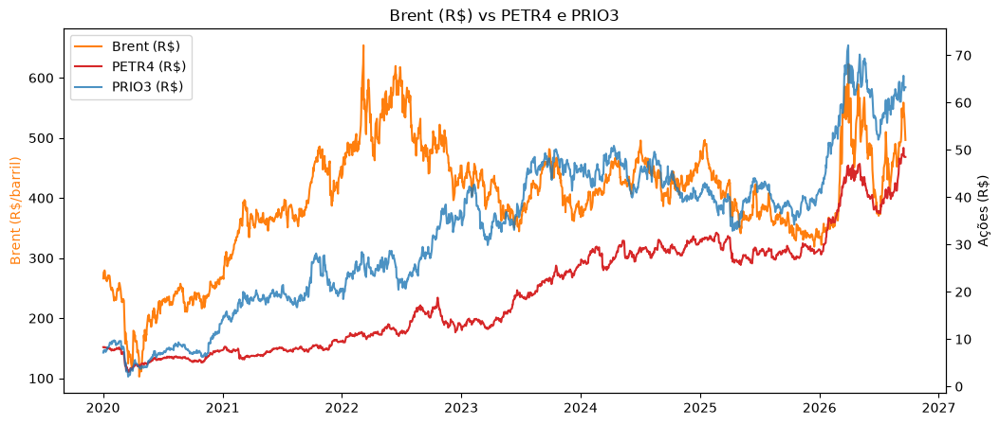
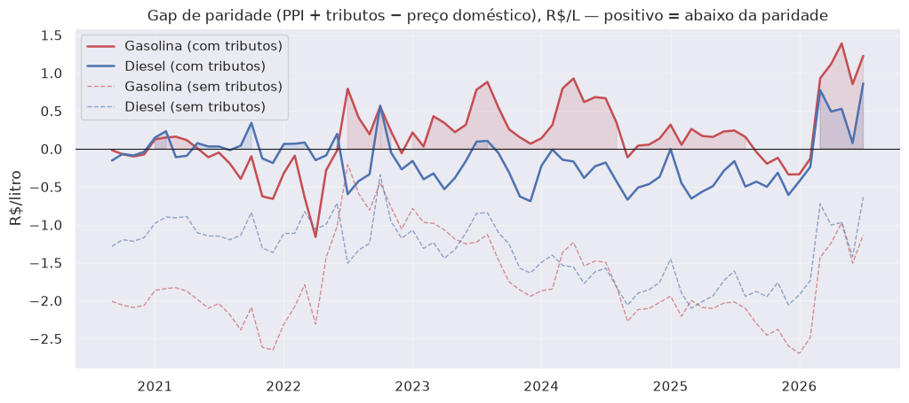
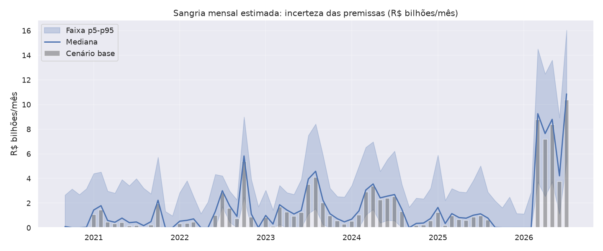

# Petróleo × PETR4 × PRIO3 — Repasse de preços e "sangria" da Petrobras


> **A pergunta.** Quando o petróleo sobe no mundo, quanto dessa alta chega ao preço do combustível
> no Brasil? Se a Petrobras segura o preço, ela vende derivados abaixo da paridade de importação —
> e a diferença, multiplicada pelo volume vendido, é uma estimativa do que ela **deixou de arrecadar**.
>
> **A resposta.** O represamento existiu, foi **seletivo e intermitente**, concentrado na gasolina.
> A sangria estimada no período fica entre **R$ 28,6 e R$ 295,1 bilhões** (mediana R$ 113,2 bi;
> cenário base R$ 98,7 bi), dependendo das premissas de tributos e custo de importação.



---

#### **TL;DR — Principais achados**

- A **PETR4 reage menos ao petróleo** que a produtora pura PRIO3: beta ao Brent de **0,39 vs 0,60**,
  e retorno total menor (**+485% vs +785%** no período).
- O **repasse do Brent ao combustível** foi incompleto e desigual: **gasolina 0,33** contra
  **diesel 0,62** (acumulado em 0–3 meses). A gasolina — politicamente sensível — repassa cerca de
  metade do diesel.
- Na média, o gap de paridade fica **perto de zero** (gasolina +0,18, diesel −0,16 R$/L): **não**
  houve congelamento contínuo.
- A "sangria" concentra-se em **janelas específicas**: 2023–24 (~R$ 17 bi/ano) e sobretudo **2026**
  (R$ 38 bi em 7 meses, com gap da gasolina ~+1,2 R$/L).
- Por ser sensível a premissas, a sangria é reportada como **faixa** (R$ 28,6–295,1 bi), não como
  número único.

**Métricas-chave**

| Indicador | PETR4 | PRIO3 |
|---|---:|---:|
| Beta ao Brent | 0,39 | 0,60 |
| Retorno total (2020–2026) | +485% | +785% |

| Repasse acumulado (0–3 meses) | Gasolina | Diesel |
|---|---:|---:|
| Sensibilidade ao Brent | 0,33 | 0,62 |

| Gap médio de paridade (R$/L) | Com tributos |
|---|---:|
| Gasolina | +0,18 |
| Diesel | −0,16 |

| Sangria acumulada (R$ bi) | Valor |
|---|---:|
| Cenário base | 98,7 |
| Faixa de sensibilidade (p5–p95) | 28,6 – 295,1 |
| Mediana (Monte Carlo) | 113,2 |

---

#### **O problema, em linguagem simples**

A Petrobras é uma empresa "completa": tira petróleo, refina e vende combustível. A PRIO3 é uma
empresa "pura": tira petróleo e vende cru. Quando o barril sobe, quem só vende petróleo ganha mais;
quem refina e vende combustível com preço segurado ganha menos.

É como comparar dois vendedores de laranja: um só colhe e vende, o outro também faz suco com preço
tabelado. Se a laranja encarece, o primeiro lucra mais — e a diferença entre os dois revela o peso
do controle de preços.

O projeto testa essa hipótese em duas frentes: **(1)** o comportamento das ações no mercado e
**(2)** o repasse efetivo do petróleo ao preço do combustível, medido contra a paridade de
importação.

---

#### **Dados**

| Fonte | Conteúdo | Frequência | Período |
|---|---|---|---|
| Yahoo Finance (`yfinance`) | Brent (`BZ=F`), gasolina RBOB (`RB=F`), diesel ULSD (`HO=F`), USD/BRL (`BRL=X`), `PETR4.SA`, `PRIO3.SA`, `^BVSP` | diária | 2020–2026 |
| ANP — Preços de combustíveis | preço médio de **distribuição** (gasolina C comum e diesel S10 comum) | mensal | 2020–2026 |
| ANP — Vendas por segmento | volume vendido de combustíveis (m³ → litros) | mensal | 2012–2025 |

Todas as fontes são públicas e baixadas em tempo de execução.

---

#### **Método**

**Fase 1 — Mercado (`01_mercado.ipynb`)**

1. Normalização das séries em base 100, para comparar escalas diferentes.
2. Beta e correlação dos log-retornos diários contra o Brent.
3. Correlação rolante (60 dias) e razão PETR4/PRIO3 ao longo do tempo.

**Fase 2 — Combustível (`02_combustivel.ipynb`)**

- **Camada A — Repasse.** Regressão OLS com defasagens:

  ```
  Δlog(preço) = α + Σₖ βₖ · Δlog(Brent_BRL)ₖ,   k = 0..3 meses
  ```

  O repasse acumulado é `Σβₖ`: perto de 1 = repasse cheio; bem abaixo = represamento.

- **Camada B — Paridade de importação e sangria.**

  ```
  PPI = (derivado internacional × câmbio) / galão + custo de importação
  gap = (PPI + tributos) − preço doméstico
  sangria = max(gap, 0) × volume vendido
  ```

  Gap positivo = Petrobras vende abaixo da paridade. Só gaps positivos entram na sangria
  (estimativa conservadora).

- **Sensibilidade da sangria.** Como o resultado depende de premissas frágeis, reportamos uma
  **faixa**: uma tabela de cenários (custo de importação, tributos, proxy) e um **Monte Carlo**
  (~2.000 simulações) variando custo de importação (R$ 0,05–0,35), acurácia dos tributos (0,8–1,2×)
  e proxy internacional (±5%), com seed fixo.

---

#### **Resultados**

**1. Mercado: a PETR4 acompanha menos o petróleo que a PRIO3**



Beta de 0,39 contra 0,60 e retorno total bem menor. A empresa integrada captura menos a alta do
petróleo — primeiro indício de interferência no repasse.

**2. Repasse: a gasolina repassa cerca de metade do diesel**



A sensibilidade acumulada é 0,33 para a gasolina e 0,62 para o diesel. O sinal mais forte aparece
justamente no combustível mais visível para o eleitor — parte da diferença, porém, vem da mistura
de etanol (27%), que amortece o Brent.

**3. Sangria: perda concentrada em janelas**


Na média o gap é próximo de zero, mas há concentração em 2021–22 e sobretudo 2026. A estimativa no
cenário base é de **R$ 98,7 bilhões**, enquanto o diesel seguiu mais de perto a paridade.

**4. Sensibilidade: a sangria é uma faixa, não um número**



Variando as premissas frágeis (custo de importação, acurácia dos tributos e proxy internacional),
a sangria acumulada vai de **R$ 28,6 a R$ 295,1 bilhões** (mediana R$ 113,2 bi). A largura da
faixa é a mensagem: o valor deve ser lido como **ordem de grandeza**, e os proxies de preço são o
fator dominante.

---

#### **Limitações e ressalvas**

- Os derivados são **proxies** (`RB=F`/`HO=F`), não a referência real de importação.
- O **custo de importação é fixo** (R$ 0,15/L) e provavelmente subestimado.
- Alíquotas de ICMS **pré-2023** (ad valorem) são aproximadas.
- O preço da ANP é de **distribuição** (inclui mistura de etanol/biodiesel e margem da distribuidora).
- **Gap ≠ intenção política**: pode refletir defasagem da política de preços e prêmios de importação.
- A **faixa de sensibilidade é larga** (R$ 28,6–295,1 bi): o número central, sozinho, superestima a
  precisão do resultado.

Por isso, o valor da sangria deve ser lido como **ordem de grandeza, não como valor exato**.

---

#### **Como reproduzir**

Requer [uv](https://docs.astral.sh/uv/) e Python ≥ 3.12.

```bash
uv sync
```

Depois, abra e execute os notebooks **na ordem**:

1. `01_mercado.ipynb` — comparação de mercado.
2. `02_combustivel.ipynb` — repasse, paridade e sangria.

As fontes (Yahoo Finance e ANP) são baixadas durante a execução.

---

#### **Próximos passos**

- Rodar a Camada A por sub-período (pré/pós mudanças de política de preços).
- Automatizar a análise de sensibilidade no pipeline modular (P1) e reportá-la por sub-período.
- Substituir os proxies RBOB/ULSD por referências reais de importação (hoje o fator dominante da faixa).
- Isolar etanol/biodiesel e rodar um teste de placebo com combustível não controlado.
